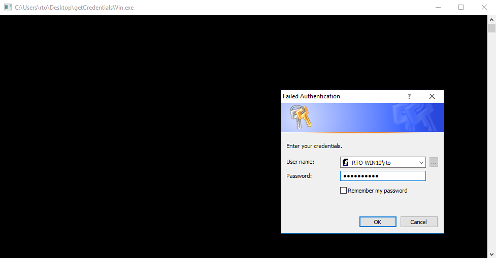
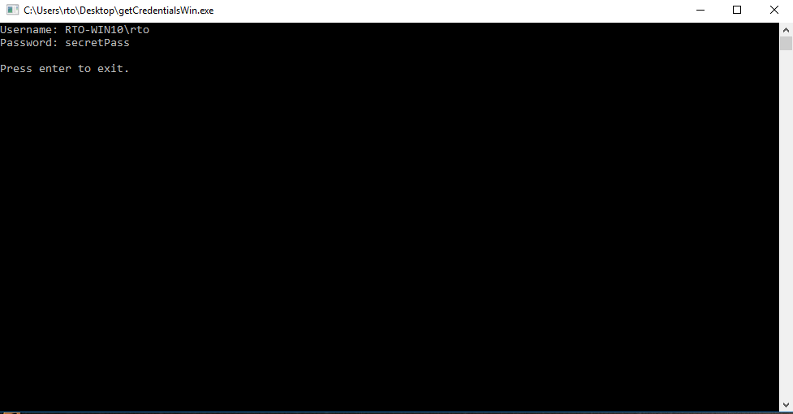

# "A Thief" - C Implementation 

## About
This project is a C implementation of the Windows privilege escalation technique called "A Thief" which I learned about in the "RTO: Privilege Escalation in Windows Course" by Sektor7.

## How It Works
The code simply prompts the user for their credentials, using the windows internal `CredUIPromptForCredentials` Function.

The username and Domain / PC-Name shown in the prompt are gathered via `LookupAccountSid`.
The function `GetCurrentUserAndDomain` is basically the code from [here](https://stackoverflow.com/questions/24968541/how-to-get-the-domain-of-currently-logged-on-user-in-windows).

The domain and username are being saved in `pszName`, the user supplied password in `pszPwd`.
Further steps would be to exfiltrate or save these credentials, because currently they only get printed out to stdout.

## Note
This code has not been tested on its stability at all, so I wouldn't recommend to use it outside of a proof-of-concept context.

## Credits
[Sektor7](https://sektor7.net) for creating the great course, in which this technique gets explained.

